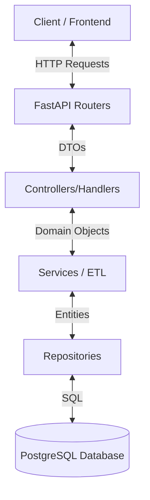

# Books API - Tech Challenge


A robust RESTful API built with **FastAPI** for managing, querying, and analyzing book data. This project is a Tech Challenge solution that integrates web scraping (ETL), database migrations, and statistical analysis of book collections into a seamless service.

---

## 📋 Table of Contents

- [Features](#-features)
- [Architecture](#-architecture)
- [Tech Stack](#-tech-stack)
- [Getting Started](#-getting-started)
  - [Prerequisites](#prerequisites)
  - [Installation](#installation)
  - [Configuration](#configuration)
- [Usage](#-usage)
  - [Running with Docker](#running-with-docker-recommended)
  - [Running Locally](#running-locally)
  - [Quick Start](#quick-start)
- [API Documentation](#-api-documentation)
- [Project Structure](#-project-structure)
- [Contributing](#-contributing)
- [Author](#-author)

---

## 🚀 Features

### 📚 Books Management
- **Catalog Navigation**: Retrieve a paginated list of books.
- **Top Rated**: Instantly access 5-star rated books.
- **Advanced Search**: Filter by title or category.
- **Price Filtering**: Find books within specific price ranges.
- **Detailed Layout**: View comprehensive information for any book.

### 📊 Analytics & Statistics
- **Market Overview**: Real-time stats on total books, average prices, and rating distributions.
- **Category Insights**: Performance metrics broken down by genre.

### ⚙️ Administration
- **Database Migrations**: Control schema changes (up/down) via API.
- **Automated ETL**: Trigger background scraping tasks to populate/update the database.
- **Health Checks**: Monitor system and database connectivity.

---

## 🏗 Architecture

The project follows a **Clean Architecture** principle to ensure scalability and maintainability:



- **Routers**: Handle incoming HTTP requests and route them to appropriate handlers.
- **Repositories**: Manage direct database interactions using SQLAlchemy.
- **Services**: Encapsulate business logic, including the ETL web scraper.
- **Background Tasks**: Handle long-running processes like scraping without blocking the API.

---

## 🛠 Tech Stack

- **Language**: [Python 3.12+](https://www.python.org/)
- **Web Framework**: [FastAPI](https://fastapi.tiangolo.com/)
- **Database**: [PostgreSQL 16](https://www.postgresql.org/)
- **ORM**: [SQLAlchemy](https://www.sqlalchemy.org/)
- **Migrations**: [Alembic](https://alembic.sqlalchemy.org/)
- **Dependency Management**: [Poetry](https://python-poetry.org/)
- **Containerization**: [Docker](https://www.docker.com/) & Docker Compose

---

## 🏁 Getting Started

### Prerequisites
- **Docker** & **Docker Compose** (Recommended)
- **Python 3.12+** & **Poetry** (If running locally)

### Installation
1. **Clone the repository**
   ```bash
   git clone https://github.com/yuriperim/FIAP-tech_challenge-books_api.git
   cd FIAP-tech_challenge-books_api
   ```

### Configuration
2. **Set up Environment Variables**
   Copy the example environment file:
   ```bash
   cp .env.development .env
   ```
   *Note: usage of `.env` allows you to configure database credentials and API settings.*

---

## 🎮 Usage

### Running with Docker (Recommended)
Launch the entire stack (API + DB) with a single command:
```bash
docker compose up --build
```
The API will be accessible at `http://localhost:8000`.

### Running Locally
If you prefer manual setup:

1.  **Install Dependencies**:
    ```bash
    poetry install
    ```
2.  **Start Database**: Ensure your local PostgreSQL is running and matches `.env` credentials.
3.  **Run Migrations**:
    ```bash
    poetry run alembic upgrade head
    ```
4.  **Start Server**:
    ```bash
    poetry run uvicorn src.books_api.main:app --reload
    ```

### Quick Start
Test the API immediately after starting:

**Check Health:**
```bash
curl -X 'GET' 'http://localhost:8000/api/v1/health'
```

**List Books:**
```bash
curl -X 'GET' 'http://localhost:8000/api/v1/books' -H 'accept: application/json'
```

---

## 📖 API Documentation

Explore the interactive API docs to test endpoints directly from your browser:

- **Swagger UI**: [http://localhost:8000/docs](http://localhost:8000/docs)
- **ReDoc**: [http://localhost:8000/redoc](http://localhost:8000/redoc)

---

## 📂 Project Structure

```text
src/books_api/
├── main.py                 # Application entry point & configuration
├── alembic/                # Database migration versions & env
├── models/
│   ├── persistent_storage/ # Database configurations & Repositories
│   └── ...                 # Pydantic models & Entities
├── routers/                # API Route definitions (Books, Admin)
└── services/               # Business logic (ETL Scraper, Helpers)
```

---

## 🤝 Contributing

Contributions are welcome! Please follow these steps:
1. Fork the project.
2. Create your feature branch (`git checkout -b feature/AmazingFeature`).
3. Commit your changes (`git commit -m 'Add some AmazingFeature'`).
4. Push to the branch (`git push origin feature/AmazingFeature`).
5. Open a Pull Request.

---

## 👤 Author

**Yuri Perim**
- Email: yuriperim@gmail.com
